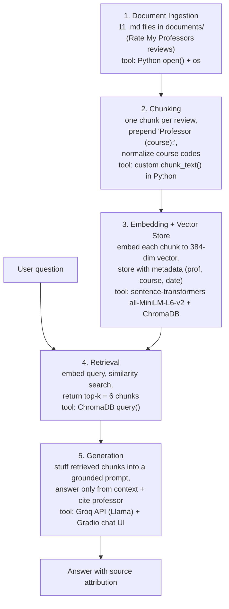

# Project 1 Planning: The Unofficial Guide

> Write this document before you write any pipeline code.
> Your spec and architecture diagram are what you'll use to direct AI tools (Claude, Copilot, etc.) to generate your implementation — the more specific they are, the more useful the generated code will be.
> Update the Retrieval Approach and Chunking Strategy sections if you change your approach during implementation.
> Update this file before starting any stretch features.

---

## Domain

<!-- What domain did you choose? Why is this knowledge valuable and hard to find through official channels? -->

**Student reviews of Computer Science professors at The City College of New York (CCNY).**

This guide makes searchable what CCNY CS students actually say about specific professors — teaching style, grading fairness, workload, exam structure, and which courses to take with whom. The official CCNY course catalog and CUNYfirst schedule list only course titles and credits; they reveal nothing about whether a professor reads off slides, curves exams, assigns a heavy group project, or roasts students for asking questions. That experiential knowledge lives scattered across Rate My Professors pages, one professor at a time, and is impossible to query as a whole — you can't ask "which professor should I take for Data Structures?" and get a synthesized answer. This system collects those reviews into one searchable corpus.

---

## Documents

<!-- List your specific sources: URLs, subreddit names, forum threads, or file descriptions.
     Aim for at least 10 sources that together cover different subtopics or perspectives within your domain. -->

All sources are individual professor pages on Rate My Professors (school 224 = City College of New York), Computer Science department. Each page's reviews were extracted into one markdown file under `documents/`. Together they span the intro sequence, data structures, software engineering, algorithms/theory, discrete math, OS, AI, and ML — and a deliberate mix of beloved and disliked professors so retrieval has contrasting opinions to surface.

| # | Source (professor) | Description | URL or location |
|---|--------|-------------|-----------------|
| 1 | Michael Grossberg | CSC 322 Software Engineering / CSC 473 — polarizing (3.6★) | [RMP](https://www.ratemyprofessors.com/professor/854471) → `documents/grossberg-michael.md` |
| 2 | George Wolberg | CSC 212 Data Structures / CSC 470-472 — highly rated (4.5★) | [RMP](https://www.ratemyprofessors.com/professor/175168) → `documents/wolberg-george.md` |
| 3 | Irina Gladkova | CSC 301 Discrete Math / CSC 217 — divisive (2.4★) | [RMP](https://www.ratemyprofessors.com/professor/422536) → `documents/gladkova-irina.md` |
| 4 | Jie Wei | CSC 322 Software Engineering — cheating/leetcode themes (3.4★) | [RMP](https://www.ratemyprofessors.com/professor/354797) → `documents/wei-jie.md` |
| 5 | Izidor Gertner | CSC 210 / CSC 342-343 Operating Systems — chaotic (2.6★) | [RMP](https://www.ratemyprofessors.com/professor/489006) → `documents/gertner-izidor.md` |
| 6 | Zhigang Zhu | CSC 212 Data Structures + grad — tough grader (3.7★) | [RMP](https://www.ratemyprofessors.com/professor/824284) → `documents/zhu-zhigang.md` |
| 7 | Erik Grimmelmann | CSC 30100 / CSC 447 Machine Learning / Senior Design — beloved (4.8★) | [RMP](https://www.ratemyprofessors.com/professor/2380866) → `documents/grimmelmann-erik.md` |
| 8 | Douglas Troeger | CSC 335 Algorithms/Theory — "hardest course in the CS curriculum" (1.9★) | [RMP](https://www.ratemyprofessors.com/professor/432142) → `documents/troeger-douglas.md` |
| 9 | Akira Kawaguchi | CSC 103 Intro to CS (dept. chair) — fast-paced (2.3★) | [RMP](https://www.ratemyprofessors.com/professor/624278) → `documents/kawaguchi-akira.md` |
| 10 | William Skeith | CSC 103 Intro to CS in C++ — fair curves, anti-AI (3.8★) | [RMP](https://www.ratemyprofessors.com/professor/1316015) → `documents/skeith-william.md` |
| 11 | Stephen Lucci | CSC 304 / CSC 448 Artificial Intelligence — easy & funny (3.9★) | [RMP](https://www.ratemyprofessors.com/professor/534845) → `documents/lucci-stephen.md` |

---

## Chunking Strategy

<!-- How will you split documents into chunks?
     State your chunk size (in tokens or characters), overlap size, and explain why those
     numbers fit the structure of your documents.
     A review-heavy corpus warrants different chunking than a long FAQ. -->

**Chunk size:** One review per chunk (~300–500 characters each, ~55 chunks total). I do *not* use a fixed character window — I split on the natural review boundary in each document file.

**Overlap:** No sliding-window character overlap. Instead, each chunk is prefixed with an attribution header — `Professor <name> (<course>):` — so the professor name and course travel with every review even though reviews don't overlap.

**Reasoning:** My documents are short, opinion-based reviews of 1–3 sentences, not long guides. A review is the natural atomic unit: it expresses one student's complete opinion and is meaningful on its own, so it's exactly the granularity a query should retrieve. A fixed-character window (e.g., 300 chars) would cut a review mid-sentence and merge two different students' opinions into one chunk, which is destructive for opinion text where polarity matters. Per-professor chunking (whole file) would be the opposite failure — it averages five contradictory reviews into one blob, so retrieval couldn't surface a specific opinion. Overlap exists to recover a fact split across a boundary; since I never split a review, there's no boundary to recover, so I prepend attribution instead of overlapping. **How I'd know it's wrong:** chunks too small (sub-sentence) → retrieval returns fragments like "tough grader" with no context; chunks too large (whole file) → every query returns the same professors and the LLM can't tell the 5★ review from the 1★ one.

**Preprocessing before chunking:** strip the markdown headers, normalize course codes (e.g., `CSC 21200` / `CSC212` → `CSC 212`) so a course-specific query matches reviews that wrote the code differently, and keep each review's quality/difficulty/date as chunk metadata.

**Refinement (added in Milestone 5):** the attribution prefix now also includes the *course name* when known — `Professor George Wolberg (CSC 212 Data Structures): …` — using a code→name map sourced from this plan's own Documents table. *Why:* during Milestone 5 testing, the eval question "which professor for **Data Structures**?" was refused, because no review text contains the words "Data Structures," only the code `CSC 212`, and grounding (correctly) wouldn't let the model assume the two are the same. Embedding the course name fixes both retrieval (the query now matches the chunk semantically) and generation (the model can connect the question to the right reviews). This is the only divergence from the original spec.

---

## Retrieval Approach

<!-- Which embedding model are you using (e.g., all-MiniLM-L6-v2 via sentence-transformers)?
     How many chunks will you retrieve per query (top-k)?
     If you were deploying this for real users and cost wasn't a constraint, what tradeoffs
     would you weigh in choosing a different embedding model — context length, multilingual
     support, accuracy on domain-specific text, latency? -->

**Embedding model:** `all-MiniLM-L6-v2` via `sentence-transformers`. It's local (free, no API), fast, produces 384-dim vectors, and handles 256 tokens of context — far more than any single review needs. It's specifically strong at sentence-level semantic similarity, which is the right fit for short opinion text. Semantic search matters here because students phrase queries differently from reviews ("easy A" vs. a review saying "no exams, easy HW"; "hard" vs. "tough grader") — embeddings match on meaning, not shared words, so a query about workload retrieves reviews that never use the word "workload."

**Top-k:** 6. With ~55 small chunks, 6 is enough to surface several reviews for one professor *and* pull in a second professor for comparison questions ("which professor for Data Structures?"), while staying small enough that the LLM context isn't diluted with off-topic reviews. Too few (k=3) risks returning only one polarity of a divisive professor or missing the comparison; too many (k=10) starts pulling unrelated reviews given how small the corpus is.

**Production tradeoff reflection:** If cost weren't a constraint and this served real students, I'd weigh a hosted model like OpenAI `text-embedding-3-large` or Voyage/Cohere embeddings. The gains I'd care about: (1) **accuracy on domain-specific text** — slang, professor nicknames, and course codes ("CSC 212", "Wes" for Skeith) are where MiniLM is weakest, and a larger model embeds those nuances better; (2) **longer context** — irrelevant here since reviews are short, but it would matter if I added long syllabus PDFs. The trade-offs against those gains are **latency and dependency** — an API call per query adds network round-trips and a hard dependency on an external service and key, versus MiniLM running locally in milliseconds. **Multilingual** support isn't a factor for an English-only corpus. For this project the local model wins; for production scale the accuracy gain on noisy domain text would likely justify the hosted model.

---

## Evaluation Plan

<!-- List your 5 test questions with their expected correct answers.
     Questions should be specific enough that you can judge whether the system's response
     is right or wrong. "What are good dining halls?" is too vague.
     "What do students say about wait times at [dining hall name] during lunch?" is testable. -->

| # | Question | Expected answer |
|---|----------|-----------------|
| 1 | Which professor should I take for Data Structures (CSC 212) and why? | Wolberg — highly rated (4.5★), review sessions mirror the exams, caring and clear; vs. Zhu who is a tough grader with pop quizzes. |
| 2 | How hard is Douglas Troeger's CSC 335, and how should I prepare? | Extremely hard — students call it "the hardest course in the CS curriculum" (1.9★, difficulty 4.7). Be fully prepared before each midterm; tough grader, test-heavy, write comments and avoid syntax errors on exams. |
| 3 | What do students say about cheating in Jie Wei's CSC 322 software engineering class? | Multiple reviews say ~90% of the class cheats on exams and the grading scheme feels unfair because of it; coding questions resemble LeetCode easy/medium. |
| 4 | Who is a good professor to take for an easy A with a light workload? | Erik Grimmelmann (4.8★, difficulty 2.1, no exams, easy HW/projects) or Stephen Lucci (3.9★, difficulty 2.4, funny, easy grader). |
| 5 | Is William Skeith's intro CS class (CSC 103) okay for a complete beginner? | Risky for a true beginner — taught in C++; reviews advise learning C++ basics (loops, functions, recursion, linked lists) beforehand. But he curves exams well and is fair to students who genuinely try (and strict about AI use). |

---

## Anticipated Challenges

<!-- What could go wrong? Name at least two specific risks with reasoning.
     Consider: noisy or inconsistent documents, missing source attribution, off-topic
     retrieval, chunks that split key information across boundaries. -->

1. **Contradictory reviews for the same professor.** Almost every professor has both 5★ and 1★ reviews (e.g., Gladkova at 2.4★ has glowing and scathing comments side by side). Retrieval may surface only one polarity depending on the query wording, producing a one-sided answer. The system needs to present the spread of opinion, not the first chunk it finds.

2. **Course-number ambiguity and noise.** The same course appears as "CSC 212", "CSC 21200", and "CSC212" across reviews, and some comments are pure noise ("British cigarette", slang, typos). A query about a specific course code may miss reviews that wrote it differently, and noisy chunks can crowd out substantive ones. Preprocessing/normalization and chunk sizing (M2) will need to account for this.

3. **Attribution across professors with overlapping courses.** CSC 322 is taught by both Grossberg and Wei; CSC 103 by both Kawaguchi and Skeith. If chunks lose the professor name, a "who teaches CSC 322?" answer could blend the two. Each chunk must carry the professor name as metadata.

---

## Architecture

<!-- Draw a diagram of your pipeline showing the five stages:
     Document Ingestion → Chunking → Embedding + Vector Store → Retrieval → Generation
     Label each stage with the tool or library you're using.
     You can use ASCII art, a Mermaid diagram, or embed a sketch as an image.
     You'll use this diagram as context when prompting AI tools to implement each stage. -->

**Pipeline in one line:** `documents/*.md` → chunk per review (Python) → embed (all-MiniLM-L6-v2) + store (ChromaDB) → retrieve top-6 (ChromaDB) → generate grounded answer (Groq) → display (Gradio).

---

## AI Tool Plan

<!-- For each part of the pipeline below, describe:
     - Which AI tool you plan to use (Claude, Copilot, ChatGPT, etc.)
     - What you'll give it as input (which sections of this planning.md, which requirements)
     - What you expect it to produce
     - How you'll verify the output matches your spec

     "I'll use AI to help me code" is not a plan.
     "I'll give Claude my Chunking Strategy section and ask it to implement chunk_text()
     with my specified chunk size and overlap" is a plan. -->

**Milestone 3 — Ingestion and chunking:**
- *Input I'll give the AI:* my **Chunking Strategy** section above plus a sample of 2–3 files from `documents/` so it sees the real format (header block + `**CSC 212 — date**` review lines).
- *What I'll ask it to produce:* a `load_documents()` that reads every `.md` in `documents/`, and a `chunk_text()` that emits one chunk per review, prepends `Professor <name> (<course>):`, normalizes course codes (`CSC 21200`/`CSC212` → `CSC 212`), and returns each chunk with metadata (professor, course, date, quality/difficulty).
- *How I'll verify:* assert chunk count is ~55 (≈5 per professor), print 3 random chunks to confirm each is a single complete review with its professor name attached and no mid-sentence cuts.

**Milestone 4 — Embedding and retrieval:**
- *Input I'll give the AI:* my **Retrieval Approach** section (model = all-MiniLM-L6-v2, top-k = 6) and the chunk objects from Milestone 3.
- *What I'll ask it to produce:* an `embed_and_store()` that loads the sentence-transformers model, embeds each chunk, and writes vectors + metadata into a ChromaDB collection; and a `retrieve(query, k=6)` that embeds the query and returns the top-6 chunks with their metadata and distances.
- *How I'll verify:* run my 5 evaluation questions and eyeball whether the top-6 chunks are on-topic — e.g., Q1 ("Data Structures professor") should surface Wolberg and Zhu (both CSC 212), not Troeger.

**Milestone 5 — Generation and interface:**
- *Input I'll give the AI:* my **Architecture** diagram, the `retrieve()` output format, and an explicit grounding instruction ("answer only from the provided reviews; if the reviews don't cover it, say so; cite the professor name for each claim").
- *What I'll ask it to produce:* a `generate_answer(query)` that calls the Groq API with the retrieved chunks as context under that system prompt, and a small Gradio chat UI wrapping it.
- *How I'll verify:* ask an out-of-corpus question ("who teaches Quantum Computing?") and confirm the system declines instead of hallucinating; confirm in-corpus answers cite the right professor.

> **Guardrail note:** I wrote the decisions in this spec myself and used AI to pressure-test the chunking choice and explain top-k / embedding trade-offs — not to generate the plan. In each milestone above I'm handing the AI a *specific section of this spec* and a concrete function signature, then verifying its output against my own expected results, so I can debug what it produces.
